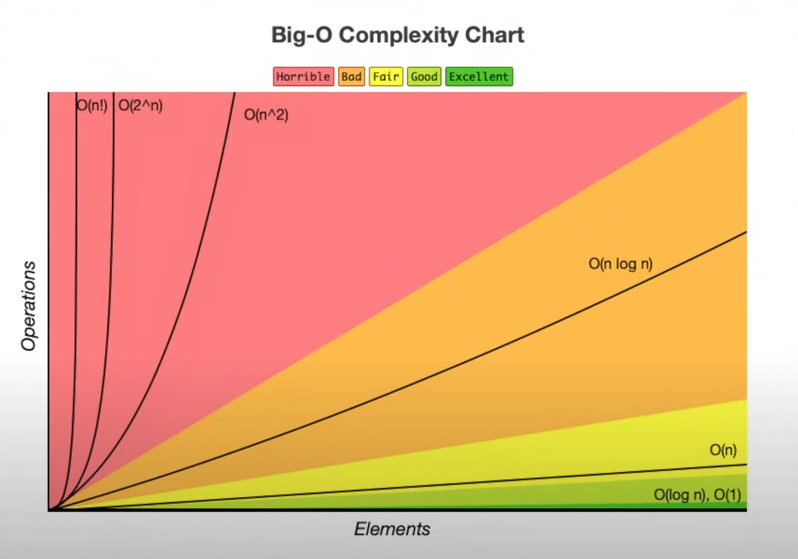

Big O -> [Asymptotic analysis][https://en.wikipedia.org/wiki/Asymptotic_analysis]

[Big O Notation: O Pesadelo do Programador Iniciante](https://www.youtube.com/watch?v=GLKDo13920k&ab_channel=LucasMontano)

Um exemplo de uma matriz ainda é O(n) por que n = quantidade de colunas \* linhas

Big O is used because is not possible to measure the complexity of an algorithm in ms or in seconds.

---
## Examples
### **Constant Time complexity**
O(1) -> O of 1 
$$
f(a) = 1 + a[0]
$$
### **Linear Time complexity**
O(n) -> O of n (iterates n times) (liner )
$$
f(a) = sum(a)
$$
### **Exponential Time complexity**
O(nˆ2) O of n squared (iterates n times * n times)
$$
f(a) = pair(a)
$$
```python
# Input
a = [1,2,3]
# Output
[[1,1], [1,2], [1,3], [2,1], [2,2], [2,3]...]
```
---
The Big O of an algorithm just takes for granted the bigger Big O
If you have an algorithm that runs 2 (2 nested) for loops:
```python
class Solution():
	def run(self):
		# O(nˆ2)
		for i in [1,2,3]:
			for f in [1,2,3]:
				print(f)
		
		# O(nˆ2)
		for i in [1,2,3]:
			for f in [1,2,3]:
				print(f)
```
The Big O of this algorithm is still O(nˆ2)