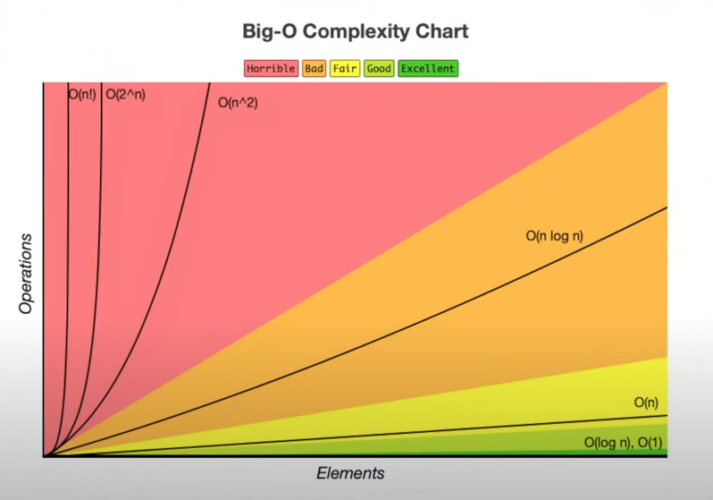

[Big O Notation: O Pesadelo do Programador Iniciante](https://www.youtube.com/watch?v=GLKDo13920k&ab_channel=LucasMontano)

Um exemplo de uma matriz ainda é O(n) por que n = quantidade de colunas \* linhas
